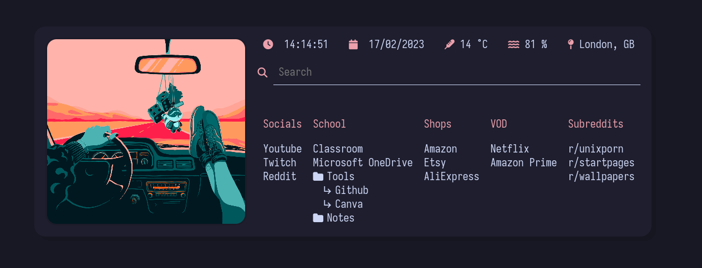
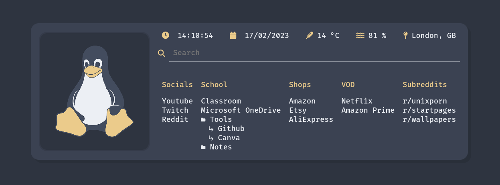
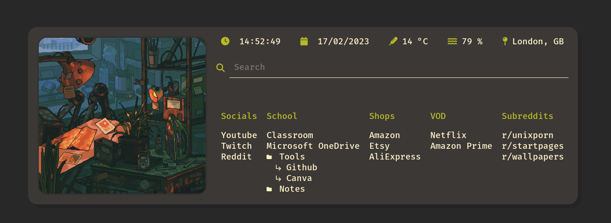
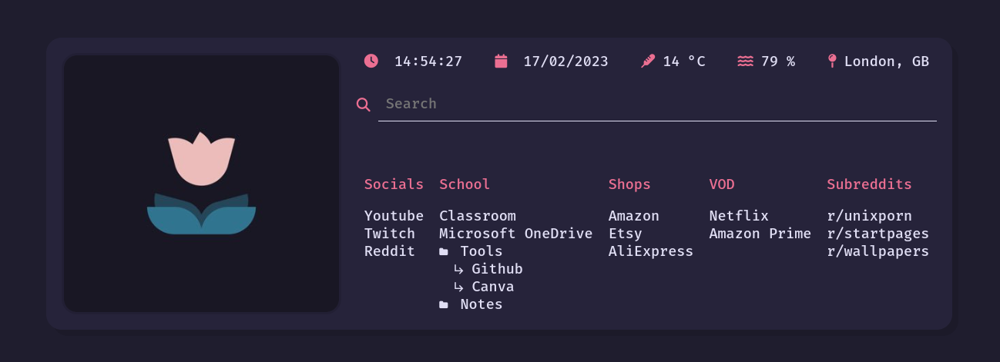

# 🏠 Startpage

Customizable startpage chrome extension.

## **📄 Features**
- [x] searching on engine of your choose (Default is Google. You can change it in Extension options)
- [x] searching saved bookmarks - ***\*bookmark***
- [x] searching saved subreddits - **/r *subreddit***
- [x] searching on Youtube - **y/ *search***
- [x] quickly going to the localhost page - **l/*port*** or **localhost:*port***
- [x] translating sentences via google translator - **tr-*target-language*=*sentence*** (e.g. **tr-pl=example**)
- [x] information about time and weather(from Open Weather API)
- [x] customizable color scheme (and gif)
- [x] importing and exporting settings using JSON
- [x] ability to group your bookmarks in folders

Full list of shortcuts you can find [HERE](#⌨-search-bar-shortcuts-cheatsheet)

## **⚙ Installation**
1. Clone the repository

        git clone https://github.com/jozwikaleksander/startpage.git
    
2. In your browser go to **Extensions** and turn on **Developer Mode**.
3. Click **Load unpacked** and choose cloned repo location.
4. Go into **Details>Extenion options**.
5. Type in your OPEN WEATHER API CALL URL. (If you don't have one follow instructions 5.1 - 5.2)

    5.1. Create account on Open Weather and get your API key.

    5.2. Create your URL ([Official guide](https://openweathermap.org/current)). In current version it should look like this.
    
        https://api.openweathermap.org/data/2.5/weather?lat={lat}&lon={lon}&appid={API key}

6. Customize your startpage looks or leave it default.
7. In your bookmarks create folder Startpage and subfolders. Save some bookmarks in subfolders. Structure of your Startpage folder should look like this.

        Startpage/
        ├─ Subfolder 1/
        │  ├─ Bookmark 1.1
        ├─ Subfolder 2/
        │  ├─ Bookmark 2.1
        ├─ Subfolder 3/
        │  ├─ Bookmark 3.1
8. Now your home page should work properly. 😃

## **🤖 Subreddits**
In order to search saved subbredits you have to create subfolder named Subreddits in your Startpage folder. Save subreddit bookmark inside this folder and make sure it's name follows this patttern **r/ name**.

        Startpage/
        ├─ Subfolder 1/
        │  ├─ Bookmark 1.1
        ├─ Subfolder 2/
        │  ├─ Bookmark 2.1
        ├─ Subfolder 3/
        │  ├─ Bookmark 3.1
        ├─ Subreddits/
        │  ├─ r/ subreddit

## **📦 Importing and exporting settings**

You can import settings from JSON in **extension settings**. Pattern for your config file you can find below.

        {
                "openWeatherAPIURL":"your_api_key",
                "startpageGif":"img/gif.gif",
                "searchEngine":"https://www.google.com/search?q=",
                "fontColor":"#ffffff",
                "fontHoverColor":"#aaaaaa",
                "backgroundColor":"#282828",
                "foregroundColor":"#3c3836",
                "accentColor":"#b8bb26",
                "fontFamily":"Roboto"
        }

To export config simply click **Export button** in **extension settings**s and your configuration will be copied to clipboard.

## **🎨 Themes**

Below you can find themes that I prepared. Feel free to modify them to your liking.

### Nord

[Link to JSON](https://github.com/jozwikaleksander/startpage/blob/main/docs/themes/nord.json)

### Catppuccin

[Link to JSON](https://github.com/jozwikaleksander/startpage/blob/main/docs/themes/cattpucin-mocha.json)

### Gruvbox

[Link to JSON](https://github.com/jozwikaleksander/startpage/blob/main/docs/themes/gruvbox.json)

### Rosepine

[Link to JSON](https://github.com/jozwikaleksander/startpage/blob/main/docs/themes/rosepine.json)

## ⌨ Search bar shortcuts cheatsheet

| 🔍 Search bar shortcut               | ⚙ Operation                                   |
|---------------------------------     	|---------------------------------------------	|
| **bookmark*                        	| searching saved bookmarks                   	|
| r/*subreddit*                        	| searching saved subreddits                  	|
| y/*search*                           	| searching on Youtube                        	|
| l/*port* or localhost:*port*        	| moving to localhost page                    	|
| tr-*target-language*=*sentence* 	| translating sentences via Google Translator 	|
| s/                              	| moving to Startpage configuration page      	|
| g/*search*                           	| searching on Google                         	|
| d/*search*                           	| searching on DuckDuckGo                     	|

## **👤 Credits**
Project was made by Aleksander Jóźwik ([@jozwikaleksander](https://github.com/jozwikaleksander)).

Default GIF I used was made by artist Waneella ([@wanella](https://twitter.com/waneella_)).
